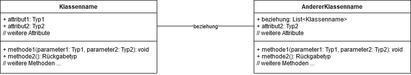
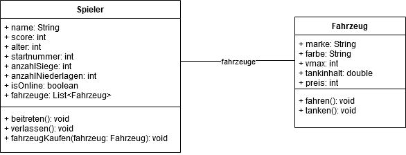
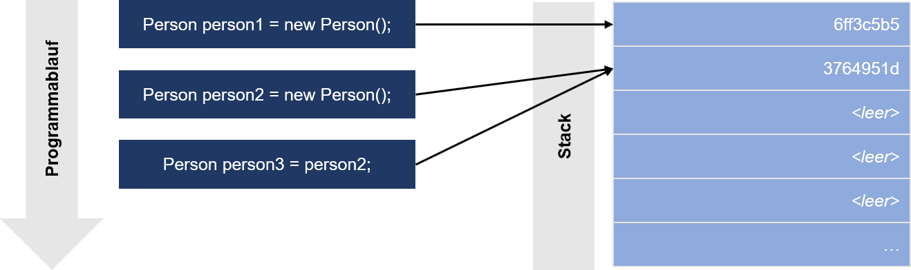
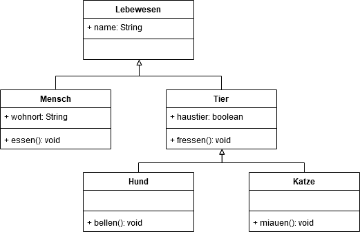

# Objektorientierte Programmierung (OOP)
## Inhaltsverzeichnis
- [Bisherige Programmstruktur](#bisherige-programmstruktur)
- [Konzept](#konzept)
- [Visualisierung](#visualisierung)
- [Klassen in Java](#klassen-in-java)
    - [`class`](#class)
    - [Attribute](#attribute)
    - [Methoden](#methoden)
    - [`this`-Referenz](#this-referenz)
    - [Vergleiche von Objekten](#vergleiche-von-objekten)
- [Datenkapselung (Encapsulation)](#datenkapselung-encapsulation)
    - [Zugriffsmodifikatoren ](#zugriffsmodifikatoren)
    - [Getter](#getter)
    - [Setter](#setter)
- [Vererbung](#vererbung)
    - [Konzept](#konzept)
    - [Abstrakte Klassen und Methoden (`abstract`)](#abstrakte-klassen-und-methoden-abstract)
    - [Schnittstellen (`interface`)](#schnittstellen-interface)
- [Polymorphie](#polymorphie)
    - [Überladung (statische Polymorphie)](#überladung-statische-polymorphie)
    - [Dynamische Polymorphie](#dynamische-polymorphie)
    

## Bisherige Programmstruktur
In den Python-Vorlesungen haben wir pro "Eigenschaft" bzw. Attribut eines Spielers eine eigene Variable angelegt.
Dadurch, dass wir beispielsweise ein Spiel bereits im Vorhinein auf zwei Spieler eingeschränkt haben, wussten wir, welche Variablen wir wann evaluieren müssen.

In Java könnte das für zwei Spieler, die einen Namen (`name`) und eine Punktzahl (`score`) haben, so aussehen:
```java
String player1_name = "Max";
String player2_name = "Moritz";

int player1_score = 0;
int player2_score = 0;
```

Möchten wir nun am Ende eines Spieldurchlaufs den Gewinner herausfinden und entsprechend an der Konsole ausgeben, könnte das so aussehen:
```java
if(player1_score > player2_score) {
    System.out.println(player1_name + " hat gewonnen!");
} else if(player1_score == player2_score) {
    System.out.println("Beide Spieler haben gewonnen!");
} else {
  System.out.println(player2_name + " hat gewonnen!");
}
```
Der Code funktioniert und tut auch was er soll, allerdings ist er nicht erweiterbar und sehr fehleranfällig.
Der Entwickelnde muss z. B. immer aufpassen, dass bei der richtigen `score` auch der richtige `name` ausgegeben wird.
Zudem ist dieser Aufbau nicht dynamisch erweiterbar.
Ein dritter und vierter Spieler können als weitere Variablen hinzugefügt werden, aber wie sieht es bei einer vorher nicht genau definierten Anzahl an Spielern aus?
 
Eine Alternative wäre die "Zusammenfassung" von den Eigenschaften in Arrays (`ArrayList`), in diesem Beispiel in `player_names` und `player_scores`.
```java
String[] player_names = {"Max", "Moritz"};
int[] player_scores = {0, 0};
```
Allerdings benötigen wir auch hier eine Konvention, beispielsweise über den Array-Index, um die verschiedenen Attribute für einen `Spieler` herauszufinden.

Viel kompakter und damit strukturierter, weniger fehleranfällig und erweiterbarer wäre es, wenn wir definieren können, welche Attribute (und Methoden) ein Spieler _generell_ unterstützt.
Diese "Vorlage" können wir dann nutzen, um beliebig viele Spieler mit diesen Attributen und Methoden, allerdings anderen Attributwerten, zu erstellen.

## Konzept
Das Prinzip, in einer "Vorlage" oder "Blaupause" zu definieren, welche Attribute und Methoden eine Entität wie ein `Spieler` besitzt, existiert und nennt sich **Objektorientierung** bzw. Objektorientierte Programmierung und wird häufig als Gegensatz zur (zuvor erläuterten) prozeduralen Programmierung gesehen.
Alles lässt sich als ein Objekt modellieren, unabhängig davon, ob es ein physisches Objekt (z. B. ein Fahrzeug) oder eine konzeptionelle Entität (z. B. eine Regel oder ein Kurs) ist, da sich für jedes Objekt die Attribute, Methoden und Beziehungen zu anderen Objekten definieren lassen, die zum "Funktionieren" bzw. Abbilden des Objekts notwendig sind.

Wichtig ist: Es gibt immer verschiedene Wege zum Ziel und deshalb nicht "die" richtige Modellierung zur Realisierung eines Programms bzw. zum Lösen eines Problems.
Trotzdem macht es Sinn, sich an akzeptierte Vorgehensweisen, Konventionen und Visualisierungen zu halten, um die Verständlichkeit und Übersichtlichkeit zu erhöhen sowie die Interoperabilität mit anderer Software und Programmierenden zu erhalten.

Zudem kann sich der Detaillierungs- und damit der Modellierungsgrad je nach Anwendung und Zeitpunkt ändern.
Reicht es beispielsweise vorerst aus, ein `Fahrzeug`-Objekt mit den zwei Integer-Attributen `farbe` (als hexadezimalen Wert) und `anzahlRaeder` zu versehen, müssen für einen anderen Anwendungsfall z. B. jedes Rad separat erfasst werden, um den jeweiligen Reifendruck zu speichern.
Dazu würde sich dann die Modellierung von `anzahlRaeder` als `Array` an `Rad`-Objekten anbieten.

## Visualisierung
Für die Visualisierung von Klassen mit ihren Attributen, Methoden und Beziehungen wird häufig die Unified Modeling Language (UML) für die Erstellung von Klassendiagrammen verwendet.
Jede Klasse ist durch einen "Kasten" repräsentiert, der je eine Sektion für Attribute und Methoden enthält. Dabei werden auch die jeweiligen Typen angegeben, 
Diese Visualisierung ist unabhängig von einer konkreten Programmiersprache, erleichtert aber trotzdem die Kommunikation mit anderen Programmierenden sowie Nicht-Programmierenden.



Für ein (einfaches) Rennspiel könnte das Beispiel so aussehen:



Durch das `+` bzw. `-` vor den Attributen und Methoden lässt sich zusätzlich die Sichtbarkeit festlegen. Mehr dazu im Abschnitt [Modifikatoren](#modifikatoren).

## Klassen in Java
### `class`

In der Regel wird pro Klasse in Java eine neue `.java`-Datei angelegt, die den gleichen Namen wie die in ihr enthaltene Klasse besitzt.
Zudem beginnen Klassen per Konvention mit einem Großbuchstaben, wohingegen Variablen mit einem Kleinbuchstaben beginnen.
Wie in allen Programmiersprachen sollte man sprechende Namen für alle Entitäten verwenden.
Man verwendet englische Begriffe, um Umlaute und anderen Sonderzeichen zu vermeiden sowie die Verständlichkeit für Mitentwickelnde anderer Nationalitäten zu ermöglichen.
Damit auch längere Variablennamen lesbar bleiben, greift man häufig auf die sogenannte `lowerCamelCase`-Schreibweise zurück: 

```java
class VeryLongYetReadablelassName {
    // Attribute und Methoden
}
```

```java
VeryLongYetReadablelassName variableWithAVeryLongYetReadableClassName = new VeryLongYetReadablelassName();
```

### Attribute
Ein Attribut beschreibt eine Eigenschaft eines Objekts. Sie werden in der "Vorlage", also in der Klasse, definiert und können für jedes Objekt einen anderen Wert besitzen.
Ein Objekt ist somit eine "Gruppierung" an Attributswerten.

```java
// Definition der Klasse "Player"
class Player {
    String name; // noch nicht initialisiert
    int score = 0; // mit 0 initialisiert
}
```

Wir haben also eine Klasse `Player` definiert, die zwei Attribute besitzt: `name` vom Typ `String` und `score` vom Typ `int`.
Jedes Objekt, das nun über die `new`-Anweisung aus dieser Klasse erzeugt wird, besitzt nun seine eigenen Werte für `name` und `score`.

```java
// Verwendung der Klasse Player
Player playerOne = new Player();
playerOne.name = "Max"; // setzt das Attribut "name" des Objekts "playerOne" vom Typ/der Klasse "Player" auf den Wert "Max"
playerOne.score += 50; // erhöht die "score" von "playerOne" um 50

System.out.println(playerOne.name + " : " + playerOne.score); // Ausgabe: "Max : 50"
```

Dies kann man einfach ausprobieren, indem man ein weiteres Objekt der Klasse `Player` erzeugt:
```java
// Verwendung der Klasse Player
Player playerTwo = new Player();
playerTwo.name = "Moritz";
playerTwo.score = 100;

System.out.println(playerTwo.name + " : " + playerTwo.score); // Ausgabe: "Moritz : 100"
``` 

### Methoden
Natürlich besitzt ein Objekt nicht nur Eigenschaften, sondern kann auch Aktionen ausführen.
Dafür verwendet man Methoden, also Funktionen für ein Objekt.
Diese werden ebenfalls in der Klasse definiert und können pro Objekt aufgerufen werden:

```java
// Definition der Klasse "Player"
class Player {
    String name; // noch nicht initialisiert

    void displayName() {
        System.out.println("Hello " + this.name + "!");
    }
}
```

```java
// Verwendung der Klasse Player
Player playerOne = new Player();
playerOne.name = "Max";

playerOne.displayName(); // Ausgabe: "Hello Max!"
```

```java
// Verwendung der Klasse Player
Player playerTwo = new Player();
playerTwo.name = "Moritz";

playerTwo.displayName(); // Ausgabe: "Hello Moritz!"
```

Für jedes Objekt wird jeweils der Wert des Objektattributs `name` ausgegeben, d.h. `playerOne` kann die Attribute von `playerTwo` nicht ohne Weiteres sehen oder modifizieren.

### `this`-Referenz
In der vorherigen Sektion [Methoden](#methoden) haben wir das Schlüsselwort `this` verwendet, um auf den Attributwert des jeweiligen Objekts, also `playerOne` bzw. `playerTwo` zuzugreifen.
`this` zeigt immer auf das Objekt selbst, über das der Aufruf der Methode stattfindet.
Daraus folgt, dass bei einem Aufruf von `playerOne.displayName()` das `this` im Methodenrumpf niemals auf das Objekt `playerTwo` verweisen kann.

Java "versteht" auch ohne `this` häufig, dass z. B. mit `name` in der Methode `displayName` das Attribut `name` gemeint ist.
Trotzdem ist es einfacher verständlich, wenn `this` bei Attributen und Methodenaufrufen im eigenen Objekt verwendet wird, da dadurch Missverständnisse vermieden werden können, wie folgendes Beispiel zeigt:

```java
public class Player {
    String name;
    
    void setName(String name) {
        name = name;
    }
}
```

Welche Variable ist hier mit `name` gemeint, der Parameter der Methode `setName` oder das Attribut `name`?
Beide Variablen `name` verweisen hier auf den Parameter der Methode, weshalb sich der Wert des Attributs `name` nicht ändert.
 
Dies ist allerdings nicht ohne weitere Analysen ersichtlich, deshalb sollte man solche Anweisungen wie folgt schreiben:

```java
public class Player {
    String name;
    
    void setName(String name) {
        this.name = name;
    }
}
``` 

Aus dieser Anweisung wird sofort klar, dass im Attribut `name` des Objekts ( `this`), auf dem `setName` aufgerufen wird, der Wert des Parameters `name` gespeichert werden soll.

### Vergleiche von Objekten
Hinweis: Für den Spezialfall `String`-Objekte siehe [Exkurs: Strings vs. Basistypen](../Exkurse/Strings%20vs.%20Basistypen.md).

Objekte sind in Java immer Referenzen auf Speicheradressen.
Dies lässt sich visualisieren, wenn man ein Objekt einer Klasse über `System.out.println()` an der Konsole ausgeben lässt.
Man erhält dann eine ähnliche Ausgabe wie `Klassenname@6ff3c5b5` anstatt einem Wert. 
Aus diesem Grund lassen sie sich nur bedingt mit dem bekannten Gleichheitsoperator `==` vergleichen.

Für viele Klassen, die bereits mit Java ausgeliefert werden, ist eine `toString()`-Methode definiert, die eine String-Repräsentation des Objekts erstellt, die entsprechend an der Konsole ausgegeben wird.
Bei diesen wird evtl. nicht die Referenz, sondern eine Zeichenkette an der Konsole ausgegeben.

```java
// Definition der Klasse "Person"
class Person {
    String name;
}
```

Im folgenden Beispiel besitzen beide Objekte der Klasse `Person` den gleichen Wert für das Attribut `name`, allerdings handelt es sich um zwei verschiedene Objekte.
Die Variable `person1` besitzt eine andere Referenz als `person2`. 

```java
// Verwendung der Klasse "Person"
Person person1 = new Person();
person.name = "Max";

Person person2 = new Person();
person.name = "Max";
```

Vergleich man die beiden Objekte auf Gleichheit (`person1 == person2`), so ist das Resultat `false`, da die damit verglichenen Speicheradressen unterschiedlich sind.



Anders verhält es sich, wenn man `person2` den "Wert" von `person2` zuweist.
In diesem Fall verweisen beide Referenzen auf den gleichen Speicherbereich, in dem ein Objekt der Klasse `Person` mit dem Wert `"Max"` für das Attribut `name` abgelegt ist. 
Folglich ergibt die Prüfung auf Gleichheit (`person1 == person2`) `true`.
```java
// Verwendung der Klasse "Person"
Person person1 = new Person();
person.name = "Max";

Person person2 = person1;
```

Detailliertere Informationen zum Thema Objektreferenzierung sowie Stack und Heap finden Sie bei [Baeldung](https://www.baeldung.com/java-stack-heap).

## Datenkapselung (Encapsulation)
In der Programmierung ist es üblich, dass Code in "Modulen" organisiert wird, um die Wiederverwendung zu erhöhen.
Ist beispielsweise ein Modul, das aus unterschiedlichen Klassen besteht, für eine Datenbankverbindung entwickelt worden, kann man dieses einfach einbinden und verwenden, anstatt alle Funktionen neu zu programmieren.
Dies erhöht die Entwicklungsgeschwindigkeit und die Sicherheit, da sich Experten auf ihre Module und Funktionalitäten konzentrieren können.
Gleichzeitig verringert es die Fehleranfälligkeit, v.a. durch Reduzierung der Komplexität des Programms.
 
Häufig ist es nicht erwünscht, dass andere Entwickelnde beispielsweise die Attribute eines Objekts selbst setzen.
Zusätzlich zur Kontrolle über das Setzen von Attributwerten kann man eine verständliche Schnittstelle über Methoden definieren, die von anderen Klassen bzw. Modulen verwendet werden muss.

Beispielsweise haben Sie eine Klasse `Product` implementiert, die nun in einer Shop-Applikation verwendet werden soll.
Das Produkt hat einen Namen und einen Preis, der den Nettopreis des Produkts speichert.

```java
class Product {
    String name;
    double price;
}
``` 

Eine andere Person, die Ihre Klasse `Product` für die Entwicklung der Shop-Applikation verwenden möchte, geht nun mangels Informationen davon aus, dass das Attribut `price` den Bruttopreis beinhaltet und implementiert dies entsprechend.

```java
Product product = new Product();
product.name = "Smartphone";
product.price = 119.0; // statt einem Nettopreis von 100.00 €
```

Folglich würden alle weiteren Berechnungen, die das Attribut `price` verwenden, mit dem falschen Preis rechnen.
Dies lässt sich verhindern, indem man sogenannte Zugriffsmodifikatoren verwendet.

### Zugriffsmodifikatoren
Im `Product`-Beispiel können wir Java mitteilen, dass wir die beiden Attribute `name` und `price` vor anderen Klassen "verstecken" möchten.
Dafür verwenden wir den Modifikator `private`, der vor der Angabe des Typs eines Attributs (oder auch einer Methode oder Klasse) geschrieben wird.

```java
class Product {
    private String name;
    private double price;
}
```

Die andere Person, die unsere Klasse nun zur Erzeugung neuer `Product`-Objekte verwendet, bekommt beim Setzen der Attribute eine Fehlermeldung angezeigt, da diese nicht von außen sichtbar und modifizierbar sind, beispielsweise:

```
Main.java:8: error: price has private access in Product
product.price = 100.0;
       ^
1 error
compiler exit status 1
```

Es gibt dazu auch weitere Zugriffsmodifikatoren, die zur Einschränkung der Sichtbarkeit verwendet werden können:

| Zugriffsart | Java-Schlüsselwort | Notation in UML-Klassendiagrammen | Beschreibung | Beispiel |
| :--- | :--- | :--- | :--- | :--- |
| Öffentlich | `public` | `+` | Für alle Objekte im Programm zugreifbar | `public String name;` |
| Package | `<leer>` | `~` | Standardsichtbarkeit in Java (bei keinen weiteren Angaben) | `String name;` | 
| Protected | `protected` | `#` | Für Objekte der eigenen Klasse und von Subklassen (siehe Vererbung) zugreifbar | `protected String name;` |
| Privat | `private` | `-` | Nur für Objekte der eigenen Klasse zugreifbar | `private String name;` |

Dadurch können Sie als Entwickelnder der Klasse `Product` festlegen, wie die Attribute `name` und `price` verändert bzw. ausgelesen werden dürfen.

Dafür verwendet man sogenannte Zugriffs- (`Getter`) und Änderungsmethoden (`Setter`), die Attributwerte zurückgeben (`get`) oder setzen (`set`).
Diese definieren nach "außen", d.h. für andere Klassen oder Pakete, welche Attribute wie ausgelesen oder geändert werden können.
Dadurch wird die tatsächliche Implementierung der Methoden bzw. der "innere Aufbau" der Klasse versteckt.
Solange folglich die Methodensignaturen (Rückgabetyp, Name, Parameter) gleich bleiben, lässt sich die Klasse weiterhin nutzen, auch wenn sich die Implementierung der Attribute und Methoden geändert hat.  

### Getter
Über einen Getter kann man bestimmen, wie ein Attribut des Objekts zurückgegeben werden soll.
Im Falle des Products kann es beispielweise Sinn machen, je eine Methode für Brutto- und Nettopreis anzubieten.
Da der Getter auch außerhalb der Klasse verwendet werden soll, muss er die Sichtbarkeit `package` oder `public` besitzen.

```java
public class Product {
    private String name;
    private double price;

    public double getNetPrice() {
        return this.price;
    }
    
    public double getGrossPrice() {
        return this.price * 1.19;
    }
}
```

Durch dieses Konzept lassen sich auch sprechende Namen für die Methoden verwenden, die dem Verwendenden beim Verständnis der "fremden" Entwicklungen helfen.

Als weiteres Beispiel dient eine Klasse `Customer`, die den vollständigen Namen zurückgeben soll, obwohl Vor- und Nachname separat über den Konstruktor gesetzt (und gespeichert) werden müssen.
```java
public class Customer {
    private String firstname;
    private String lastname;
    
    // Konstruktor
    public Customer(String firstname, String lastname) {
        this.firstname = firstname;
        this.lastname = lastname;
    }

    // Getter für den vollständigen Namen
    public String getFullName() {
        return this.firstname + " " + this.lastname;
    }
}
```

### Setter
Analog zum Getter ermöglicht der Setter beispielsweise die Validierung der Eingabe, bevor die als Parameter übergebenen Werte tatsächlich einen Attributwert überschreibt.
Möchte man verhindern, dass z. B. das Attribut `name` eines Objekts der `Product`-Klasse mit einem leeren String versehen wird, kann man dies über einen Setter abfangen:

```java
public class Product {
    private String name;
    private double price;

    public void setName(String name) {
        if(name.equals("")) {
            System.out.println("Ein leerer Produktname ist nicht erlaubt. Der Wert wurde nicht gespeichert.");
        } else {
            this.name = name;
        }
    }
}
``` 

Zusätzlich muss beachtet werden, dass bei strikter Befolgung des Prinzips der Datenkapselung (fast) alle Attribute `private` oder `protected`, also für andere Klassen nicht sichtbar sind.
Daher muss für jedes Attribut, dass auslesbar bzw. modifizierbar sein soll, ein Getter bzw. Setter definiert werden.
Als Namenskonvention verwendet man die beiden Begriffe `get` und `set` und hängt in der bekannten `lowerCamelCase`-Schreibweise den Attributnamen an, z. B. `getName` oder `setPrice`. 

## Vererbung
### Konzept
In vielen Fällen ist es notwendig, Klassen je nach Anwendungsfall zu erweitern bzw. zu spezialisieren.
Dazu wird das Konzept der Vererbung (inheritance) verwendet.
Dabei wird zwischen einer Kind- und einer Elternklasse unterschieden.
Die Kindklasse erbt von der Elternklasse und übernimmt alle sichtbaren (siehe [Zugriffsmodifikatoren](#zugriffsmodifikatoren)) Attribute und Methoden der Elternklasse.

In einem stark vereinfachten Beispiel definieren wir eine Klasse `Lebewesen`, die alle Attribute und Methoden enthält, die für alle Lebewesen gültig sind (hier nur `name`).
Von der Klasse `Lebewesen` erben die beiden Klassen `Mensch` und `Tier` (im Klassendiagramm durch einen nicht ausgefüllten Pfeil dargestellt), d.h. sowohl Objekte der Klasse `Mensch` als auch der Klasse `Tier` besitzen ein Attribut `name`.
Aufgrund der Vererbungsbeziehung muss dieses Attribut nicht erneut für den `Mensch` oder das `Tier` definiert werden.
Folglich sind `Mensch` und `Tier` Spezialisierungen von `Lebewesen`, wohingegen `Lebewesen` eine Generalisierung von `Mensch` und `Tier` ist.

 

Zusätzlich deklarieren wir für ein Objekt der Klasse `Mensch` ein Attribut `wohnort` und eine Methode `essen()`.
Das `Tier` hingegen besitzt eine Eigenschaft `haustier` (Typ `boolean`) und die Methode `fressen()`.

Unser Modell kann um beliebig viele Hierarchieebenen erweitert werden.
Beispielweise können wir die zwei Klassen `Hund` und `Katze` definieren, die von der Klasse `Tier` erben und zusätzlich zu `name`, `haustier` und `fressen()` (alle vererbt) die Methoden `bellen()` bzw. `miauen()` besitzen.
Allerdings kann in Java eine Klasse nicht von zwei anderen Klassen gleichzeitig erben.

Möchten wir unser Klassendiagramm in Java "übersetzen", benötigen wir zur Kenntlichmachung der Vererbungsbeziehung lediglich das Schlüsselwort `extends` in der Klassendefinition.

```java
class Lebewesen { // kein extends, da wir keine Vererbungsbeziehung (zu einer Elternklasse) definiert haben
    public String name;
}

class Mensch extends Lebewesen {
    public String wohnort;
    
    public void essen() {
        System.out.println("Der Mensch isst.");
    }
}

class Tier extends Lebewesen {
    public boolean haustier;
    
    public void fressen() {
        System.out.println("Das Tier frisst.");
    }
}
```

Die Klassen `Hund` und `Katze` müssen von `Tier` und nicht von `Lebewesen` erben, damit wir auch das Attribut `haustier` sowie die Methode `fressen()` nutzen können:

```java
class Hund extends Tier {
    public void bellen() {
        System.out.println("Wau wau!");
    }
}

class Katze extends Tier {
    public void miauen() {
        System.out.println("Miau!");
    }
}
```

Mit der Klasse, deren Konstruktor wir bei der Initialisierung eines Objekts aufrufen (`new`), können wir bestimmen, um welches Lebewesen es sich handelt.

```java
Lebewesen einLebewesen = new Lebewesen(); // -> Lebewesen
einLebewesen.name = "Ein Lebewesen";
einLebewesen.fressen(); // Fehler, da fressen() nicht für die Klasse "Lebewesen" definiert ist

Hund wauwau = new Hund(); // -> Hund
wauwau.name = "Wau Wau";
wauwau.fressen(); // Ausgabe: "Das Tier frisst."
wauwau.miauen(); // Fehler, da miauen() nicht für die Klasse "Hund" definiert ist
``` 

### Abstrakte Klassen und Methoden (`abstract`)
In manchen Fällen möchten wir verhindern, dass eine Klasse initialisiert werden kann.
Beispielsweise möchten wir zwar die Vorzüge der Vererbung nutzen, ein Objekt der Klasse `Lebewesen` soll aber nicht existieren dürfen.
Dadurch muss immer eine spezialisierte Klasse wie z. B. `Mensch` oder `Hund` initialisiert werden.
Dazu verwenden wir das Schlüsselwort `abstract`.
Dies teilt dem Compiler mit, dass die Anweisung `new Lebewesen();` nicht gültig ist, da Objekte der Klasse `Lebewesen` nicht existieren dürfen.

```java
abstract class Lebewesen { // kein extends, da wir keine Vererbungsbeziehung (zu einer Elternklasse) definiert haben
    public String name;
}

class Mensch extends Lebewesen {
    public String wohnort;
    
    public void essen() {
        System.out.println("Der Mensch isst.");
    }
}
```

```java
Lebewesen einLebewesen = new Lebewesen(); // Fehler, da "Lebewesen" abstrakt ist

Mensch einMensch = new Mensch(); // funktioniert
```

Auch die Methoden einer abstrakten Klasse können als `abstract` definiert werden.
Dadurch wird in der abstrakten Klasse zwar die Methodensignatur (Name, Parameterliste, Rückgabetyp und Sichtbarkeit) definiert, nicht aber der Methodenrumpf, der die konkrete Implementierung enthält.
Eine Klasse, die von dieser abstrakten Klasse erbt, muss die abstrakte Methode selbst implementieren.

```java
abstract class Lebewesen { // kein extends, da wir keine Vererbungsbeziehung (zu einer Elternklasse) definiert haben
    public String name;
    
    public abstract void detailsAusgeben(); // keine { }, da eine abstrakte Methode keinen Methodenrumpf besitzt 
}

class Mensch extends Lebewesen {
    public String wohnort;

    @Override // Annotation als Hinweis an den Compiler, dass die Methoden hier "wissentlich" überschrieben wurde
    public void detailsAusgeben() { // Die Methode muss hier "mit Leben gefüllt werden"
        System.out.println("Ich bin ein Mensch und heiße " + this.name);
    }    

    public void essen() {
        System.out.println("Der Mensch isst.");
    }
}

class Tier extends Lebewesen {
    public boolean haustier;

    @Override // Annotation als Hinweis an den Compiler, dass die Methoden hier "wissentlich" überschrieben wurde
    public void detailsAusgeben() { // Die Methode muss hier "mit Leben gefüllt werden"
        System.out.println("Ich bin ein Tier und heiße " + this.name);
    }      

    public void fressen() {
        System.out.println("Das Tier frisst.");
    }
}
```

Ist die Methode `detailsAusgeben()` von `Lebewesen` nicht als `abstract` definiert, muss sie einen Methodenrumpf besitzen und wird entsprechend an die Subklassen vererbt.

```java
abstract class Lebewesen { // kein extends, da wir keine Vererbungsbeziehung (zu einer Elternklasse) definiert haben
    public String name;
    
    public void detailsAusgeben() {
        System.out.println("Ich bin ein Lebewesen und heiße " + this.name);
    }
}

```

### Schnittstellen (`interface`)

Interfaces sind sehr ähnlich zu abstrakten Klassen, können allerdings nur Methodendeklarationen (bzw. -signaturen) und keine Implementierungen dieser enthalten.
Schnittstellen können wie eine abstrakte Klasse ebenfalls nicht initialisiert werden.
Außerdem ist es nicht möglich, Variablen in einem Interface zu definieren, da alle dort definierten Attribute automatisch `final` und dadurch Konstanten sind (siehe [Java Basics](Java-Basics.md#konstanten)).

Wie auch eine Klasse wird ein Interface in einer separaten Datei deklariert, wird allerdings mit `interface` statt `class` bezeichnet.

```java
interface Charakter { // z. B. in einem Computerspiel
    String getTyp(); // jede Klasse, die das Interface "Charakter" implementiert muss auch "getTyp()" implementieren
}
```

Eine andere Klasse kann die definierte Schnittstelle implementieren.
Dafür wird das Schlüsselwort `implements` verwendet.
Der Compiler "garantiert" anschließend, dass bei Ausführung des Programms alle im Interface definierten Methoden mit der entsprechenden Signatur von allen mit `implements` versehenen Klassen implementiert wurden.  

```java
class Mensch implements Charakter {
    @Override
    public String getTyp() { // muss implementiert werden, damit "Mensch" zu Schnittstelle "Charakter" konform ist
        return "Mensch";
    }
}
```

Wie im Abschnitt [Konzept](#konzept) erläutert ist in Java zwar das Erben von mehreren Klassen nicht möglich, allerdings lassen sich `extends` und `implements` kombinieren.

```java
class Katze extends Tier implements Charakter {

    public void miauen() {
        System.out.println("Miau!");
    }

    @Override
    public String getTyp() { // muss implementiert werden, damit "Katze" zu Schnittstelle "Charakter" konform ist
        return "Katze";
    }
}
```

```java
Katze katerFelix = new Katze();
katerFelix.name = "Felix";
katerFelix.fressen(); // Ausgabe: "Das Tier frisst."

System.out.println(katerFelix.getTyp()); // Ausgabe: "Katze"
```

Um zu entscheiden, ob eine abstrakte Klasse oder eine Schnittstelle besser für die Umsetzung eines Szenarios geeignet ist,
sollte analysiert werden, ob die "Elternklasse" Variablen oder bereits implementierte Methoden besitzen muss.
Ist dies der Fall, ist eine abstrakte Klasse die richtige Wahl, da in dieser auch veränderbare (nicht konstante) Attribute sowie vererbbare Methoden definiert werden können.
Ist das Ziel die Vorgabe von Methodensignaturen, beispielsweise um eine "Garantie" über die verfügbaren Methoden zu erreichen, ist ein Interface wahrscheinlich die bessere Wahl.

## Polymorphie
### Überladung (statische Polymorphie)
Java unterstützt als Sprache mit statischer Typisierung das sogenannte Überladen von Methoden, was auch als statische Polymorphie bezeichnet wird.
Dabei kann der Compiler anhand der Methodensignatur bei mehreren gleichnamigen Methoden erkennen, welche Methode ausgeführt werden soll.
Im Gegensatz zum Überschreiben bei der Vererbung bzw. bei Interfaces wird nicht die gesamte Methode überschrieben, sondern um eine weitere "Variante" ergänzt.

Beispielweise möchten wir für ein Objekt der Klasse `Mensch` zwei "Varianten" der Methode `essen()` anbieten:
Eine gibt eine "generische" Meldung aus, eine andere spezifiziert genauer, was der Mensch isst.

```java
class Mensch extends Lebewesen {
  
    // Attribute und überschriebene Methoden aus Übersichtlichkeitsgründen ausgelassen    

    public void essen() {
        System.out.println("Der Mensch isst.");
    }

    public void essen(String nahrungsmittel) {
        System.out.println("Der Mensch isst " + nahrungsmittel);
    }
}
```

```java
Mensch einMensch = new Mensch();
einMensch.essen(); // Ausgabe: "Der Mensch isst."
einMensch.essen("Brot"); // Ausgabe: "Der Mensch isst Brot"
```

Soll eine Methode überladen werden, müssen alle "Varianten" dieser Methode den gleichen Namen besitzen.
Die Anzahl, Reihenfolge und die Typen der erwarteten Parameter dient dann als "Entscheidungsgrundlage" für den Compiler, welche Methode tatsächlich aufgerufen wird.
Allerdings kann Java die überladenen Methoden nicht am Rückgabetyp unterscheiden:

```java
public int zufallszahl() {
    // gebe eine ganzzahlige Zufallszahl zurück
}

public double zufallszahl() {
    // gebe eine Gleitkomma-Zufallszahl zurück
}
```

Ruft man `zufallszahl();` auf, kann der Compiler nicht unterscheiden, ob wir als Rückgabetyp `int` oder `double` erwarten.

### Dynamische Polymorphie

Die im vorherigen Abschnitt erläuterte statische Polymorphie wird bereits beim Kompilieren vom Compiler "aufgelöst".
Im Gegensatz dazu wird bei der dynamischen Polymorphie erst zur Laufzeit des Programms entschieden, welche "Variante" (in dem Fall welcher Typ) ausgewählt werden soll. 
Aus diesem Grund wird die dynamische Polymorphie auch Laufzeitpolymorphie genannt.

Wir erweitern unser Beispiel, indem wir für `Hund` und `Katze` jeweils die vererbte Methode `fressen()` überschreiben:

```java
class Hund extends Tier {
    @Override
    public void fressen() {
        System.out.println("Der Hund frisst Hundefutter.");
    }
}

class Katze extends Tier {
    @Override
    public void fressen() {
        System.out.println("Die Katze frisst Katzenfutter.");
    }
}
```

```java
Tier katerFelix = new Katze(); // wir speichern eine Referenz auf ein "Katze"-Objekt in einer Variablen vom Typ "Tier"
katerFelix.fressen(); // Ausgabe: "Die Katze frisst Katzenfutter."
```

Zur Laufzeit hat der Java-Interpreter nun entschieden, dass beim Aufruf von `fressen()` die Implementierung der Methode von `Katze` aufgerufen wird, obwohl die Variable mit dem Typ `Tier` deklariert wurde.
Dass `katerFelix` trotzdem die Klasse `Katze` besitzt, lässt sich auch über die Ausgabe von `katerFelix.getClass()` überprüfen (`class Katze`). 

Die dynamische Polymorphie ist insbesondere hilfreich, wenn man beispielsweise eine Menge an `Tier`-Objekte in einem gemeinsamen Array speichern möchte, unabhängig von dem tatsächlichen Typ.

```java
Tier[] tiereArray = new Tier[4];
tiereArray[0] = new Katze();
tiereArray[1] = new Hund();
tiereArray[2] = new Tier(); // ein "generelles" Tier, also kein "Hund" und keine "Katze"
tiereArray[3] = new Katze();

for(int i = 0; i < tiereArray.length; i++) {
    System.out.println(tiereArray[i].getClass());
    tiereArray[i].fressen();
}
```

Da zur Laufzeit bei jedem Aufruft von `fressen()` in der Schleife "ermittelt" wurde, welchen Typ das jeweilige Element "tatsächlich" besitzt, sieht die Ausgabe an der Konsole wie folgt aus:

```text
class Katze
Die Katze frisst Katzenfutter.
class Hund
Der Hund frisst Hundefutter.
class Tier
Das Tier frisst.
class Katze
Die Katze frisst Katzenfutter.
```

Allerdings ist in der Schleife nur der Zugriff auf Attribute und Methoden möglich, die ein `Tier` auch besitzt.
Die Anweisung `tiereArray[i].miauen();` erzeugt beispielsweise einen Fehler, da `miauen()` für `Tier` nicht definiert ist.
Ist der Aufruf der "spezialisierten" Methoden notwendig, muss eine Typumwandlung (siehe [Java Basics](Java-Basics.md#typumwandlung-typecast)) vorgenommen werden, nachdem die "tatsächliche" Klasse ermittelt wurde:

```java
for(int i = 0; i < tiereArray.length; i++) {

  if(tiereArray[i].getClass() == Katze.class) {
    Katze eineKatze = (Katze) tiereArray[i]; // Typumwandlung zur Spezialisierung "Katze"
    eineKatze.miauen();
  } else if(tiereArray[i].getClass() == Hund.class) {
    Hund einHund = (Hund) tiereArray[i]; // Typumwandlung zur Spezialisierung "Hund"
    einHund.bellen();
  } else {
    System.out.println("Ein generelles Tier gibt keinen Laut von sich.");
  }
}
```

Die modifizierte Schleife erfolgt folgende Ausgabe:

```text
Miau!
Wau wau!
Ein generelles Tier gibt keinen Laut von sich.
Miau!
```

Weitere Informationen zum Konzept der Polymorphie finden Sie in der Onlineversion des Buchs [Objektorientierte Programmierung](http://openbook.rheinwerk-verlag.de/oop/oop_kapitel_05_002.htm) von Bernhard Lahres und Gregor Rayman.
